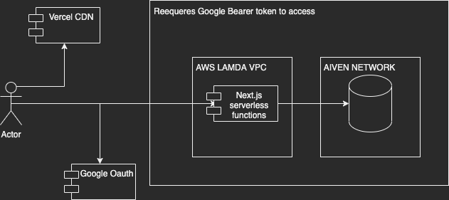

# muoto threat modeling diagram
We did a preliminary risk assessment of the different modules we have running.

We use Google OAuth as our OAuth provider and we are not using
very much user data from there, only name and email.

No writes can be done to the database without a valid Bearer token issued by Google OAuth. 
Each SQL query that touches user data require a session to be present and it uses
that session to get the user id for the SQL queries.